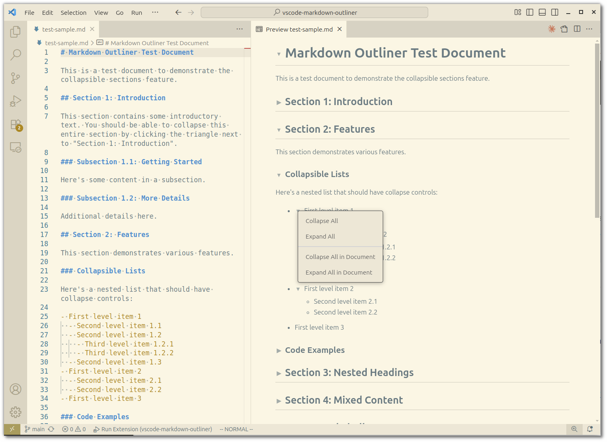

# VSCode Markdown Outliner

A VSCode extension that adds collapsible sections to the markdown preview, making it easy to navigate and organize long documents.

**Repository**: https://github.com/timabell/vscode-markdown-outliner

**Marketplace**: https://marketplace.visualstudio.com/items?itemName=timabell.markdown-outliner



## Features

- **Collapsible Headings**: Click the triangle icon next to any heading to collapse/expand all content under that heading
- **Collapsible Lists**: Nested lists can be collapsed to hide sub-items
- **Context Menu**: Right-click any triangle icon for options to collapse/expand all sections
- **Persistent State**: Your collapse/expand preferences are saved and restored when you reopen files

## Usage

1. Open any markdown file in VSCode
2. Open the preview pane (Ctrl/Cmd + Shift + V)
3. Click the triangle icons (▶/▼) next to headings or list items to collapse/expand them
4. Right-click any triangle icon to access:
   - **Collapse All** - Collapse all nested sections under this heading/list
   - **Expand All** - Expand all nested sections under this heading/list
   - **Collapse All in Document** - Collapse all sections in the entire document
   - **Expand All in Document** - Expand all sections in the entire document

### Headings

When you collapse a heading, all content up to the next heading of the same or higher level will be hidden.

Example:
```markdown
## ▼ Section 1
Content here...
### Subsection 1.1
More content...
## ▼ Section 2
```

Clicking the triangle at the start of the "Section 1" heading will hide everything until "Section 2".

### Lists

Nested lists automatically get collapse/expand controls:

```markdown
- ▼ Item 1
  - Sub-item 1.1
  - Sub-item 1.2
- Item 2
```

## Testing Locally

### Quick Start

1. **Install dependencies:**
   ```bash
   npm install
   ```

2. **Compile the TypeScript:**
   ```bash
   npm run compile
   ```

3. **Run the extension:**
   - Open this folder in VSCode
   - Press `F5` (or Run → Start Debugging)
   - VSCode will compile the TypeScript and open a new window with `[Extension Development Host]` in the title bar
   - In that new window, open the included [test-sample.md](test-sample.md) file
   - Press `Ctrl/Cmd + Shift + V` to open the markdown preview
   - You should see triangle icons (▶/▼) next to headings and nested list items

4. **Test the features:**
   - Click the triangles to collapse/expand individual sections
   - Right-click any triangle to collapse/expand all children or all in document
   - Collapse state is automatically saved and restored

### Development Workflow

For active development with auto-recompilation:

```bash
npm run watch
```

This will watch for file changes and automatically recompile. After making changes:
- In the Extension Development Host window, press `Ctrl/Cmd + R` to reload the window
- Or use the "Developer: Reload Window" command from the Command Palette

### Debugging

- Set breakpoints in [src/extension.ts](src/extension.ts)
- The preview scripts ([media/outliner.js](media/outliner.js)) run in the webview context
- To debug the preview scripts, open DevTools in the preview pane:
  1. Focus the markdown preview
  2. Run command: "Developer: Open Webview Developer Tools"
  3. Check the Console tab for any errors

## Installation

### From VSCode Marketplace

1. Open VSCode
2. Go to Extensions (Ctrl/Cmd + Shift + X)
3. Search for "Markdown Outliner"
4. Click Install

Or install from the command line:
```bash
code --install-extension timabell.markdown-outliner
```

### From VSIX (for development/testing)

To package and install the extension manually:

```bash
npm install -g @vscode/vsce
vsce package
code --install-extension markdown-outliner-0.1.0.vsix
```

## Requirements

- VSCode 1.109.0 or higher

## Known Issues

- The bidirectional sync between editor folding and preview folding is not yet implemented
- State is stored per-document based on content, so restructuring a document may reset the collapse state

## Development

### CI/CD Pipeline

This project uses GitHub Actions for automated testing, building, and releases. See [doc/pipeline.md](doc/pipeline.md) for details on:
- Semantic commit conventions
- Automated version bumping
- Release workflow
- Publishing to VS Code Marketplace

## Related

This extension addresses the feature request in [microsoft/vscode#115998](https://github.com/microsoft/vscode/issues/115998).

## License

A-GPL v3
